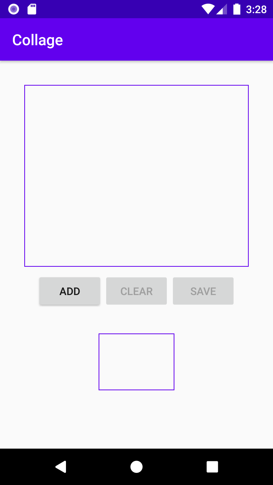
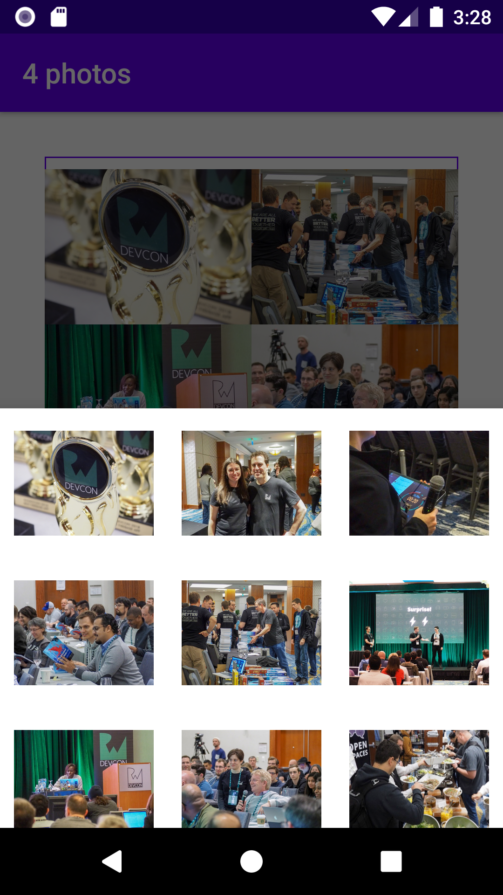
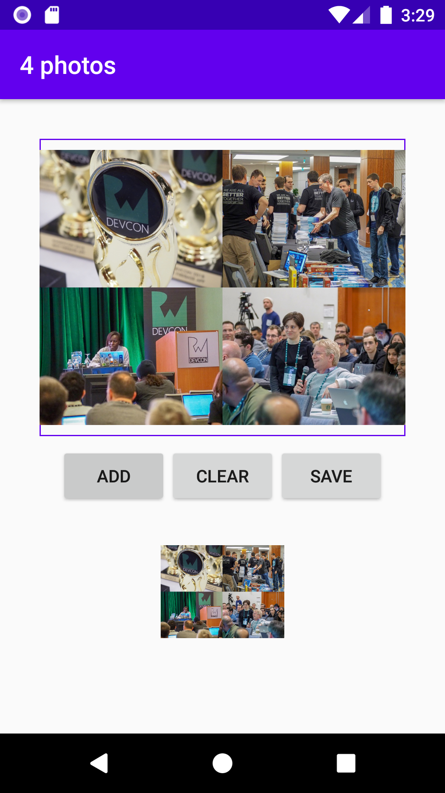

# Combinestagram

**Goal**: Create an application allowing to do several collage of images.

## Phone display

     

       

## Comments
* It is a project to learn more about reactive programming.
* This application is based on a [book of raywenderlich.com](https://store.raywenderlich.com/products/reactive-programming-with-kotlin)

## Requirements
* Computer (Windows, Mac or Linux)
* Android Studio

## Setup the project in Android studio
1. Download the project code, preferably using `git clone https://github.com/YannMancel/Combinestagram.git`.
2. In Android Studio, select *File* | *Open...*
3. Select the project
     
     
## Compile and execute the project in Android studio
1. In Android Studio, select *Run* | *Run...*
2. Choose `app` in *Run dialog*
3. Select a device (*Available Virtual Devices* or *Connected Devices*)
4. Select `OK` in *Select Deployment Target dialog*

## Wiki
* [Android Jetpack](https://developer.android.com/jetpack)
  * [Architecture Components](https://developer.android.com/topic/libraries/architecture/)
    * [LiveData](https://developer.android.com/topic/libraries/architecture/livedata)
    * [ViewModel](https://developer.android.com/topic/libraries/architecture/viewmodel)
* [Reactive programming](http://reactivex.io/)
  * [Library RxAndroid](https://github.com/ReactiveX/RxAndroid)
  * [Library RxKotlin](https://github.com/ReactiveX/RxKotlin)
* [Library Material Components](https://github.com/material-components/material-components-android)
* [Library Timber](https://github.com/JakeWharton/timber)
* [Library Picasso](https://github.com/square/picasso)

## Troubleshooting

### No device available during the compilation and execution steps 
* If none of device is present (*Available Virtual Devices* or *Connected Devices*),
    * Either select `Create a new virtual device`
    * or connect and select your phone or tablet
     
     
## Useful
* [Download Android Studio](https://developer.android.com/studio)
* [Create a new virtual device](https://developer.android.com/studio/run/managing-avds.html)
* [Enable developer options and debugging](https://developer.android.com/studio/debug/dev-options.html#enable)